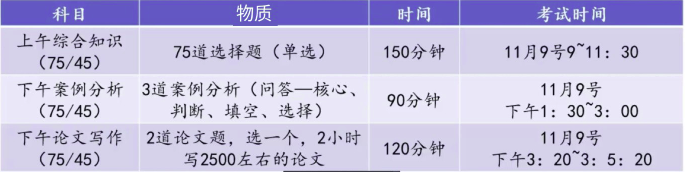

# 高项介绍

## 1、高项考试游戏规则

- 信息系统项目管理师考试是全国计算机技术与软件专业技术资格(水平)考试下面的一个高级科目，自 2005 年开考至今，每年 2 次 (5.25 和 11.9) 历经 29 次考试，根据国家有关规定通过考试就等同于拿到了高级职称(高级工程师，副高级)，由于具有极高的权威性，越来越受到考生的亲魅，最近几年参考人数越来越多!最近几次考试通过率还是及其高的!
- 
- 总分 75 分，45 分及格，上午、案例或者论文都可能是卡人的地方

## 2、职称的作用（中高级职称）

- 升职加薪(聘任中高级工程师)
- 投标(项目经理或者技术负责人要求)
- 评标专家(职称+工作经验+证书)
- 人才引进(职称)
- 落户 (职称)

## 3、讲课用书

- 《信息系统项目管理师教程》
- 《信息系统项目管理师-综合知识金色考点》
- 《信息系统项目管理师-综合知识历年分章节真题解析》
- 《信息系统项目管理师-论文写作梳理暨优秀范文集》
- 《信息系统项目管理师-高频考点口袋书》
- 《信息系统项目管理师-案例分析金色考点离你那分章节真题解析》

## 4、刷题小程序

- 微信小程序搜索“江山老师题库”
- 已录入：历年真题和随机练习

## 5、学习方法探讨

- 正确的判断（学习？研究？还是应试？）
- 方法
  - 考哪里学哪里（考点）
  - 怎么考怎么学（题型）
- 依据：历年真题
  - 先看题后看书
  - （听课）
  - 边做题边翻书
- 考试真理：“新真题，得永生”

### 1）终极学习法——费曼技巧

1. 被动学习
   1. 听讲（两周留存率：5%）
   2. 阅读（两周留存率：10%）
   3. 视听（两周留存率：20%）
   4. 演示（两周留存率：30%）
2. 主动学习
   1. 讨论（两周留存率：50%）
   2. 实践（两周留存率：75%）
   3. 教授给他人（两周留存率：90%）

#### 学习步骤

- 第一步，选择一个你想要理解的概念然后拿出一张白纸，把这个概念写在白纸的最上边。
- 第二步，设想一种场景，你正要向别人传授这个概念在白纸上写下你对这个概念的解释, 就好像你正在教导一位新接触这个概念的学生一样。当你这样做的时候, 你会更清楚地意识到关于这个概念你理解了多少, 以及是否还存在理解不清的地方。
- 第三步， 如果你感觉卡壳了, 就回顾一下学习资料，无论何时你感觉不清楚了,都要回到原始的学习资料并重新学习让你感到不清楚的那部分,直到你领会得足够顺畅, 顺畅到可以在纸上解释这个部分为止。
- 第四步，为了让你的讲解通俗易懂，简化语言表达最终的目的, 是用你自己的语言, 而不是学习资料、课程中的语言来解释概念。如果你的解释很冗长或者令人迷惑, 那就说明你对概念的理解可能并没有你自己想象得那么顺畅，你要努力简化语言表达, 或者与已有的知识建立一种类比关系, 以便更好地理解它。

### 2）如何去学习

1. 视频听课过程中，只需要把降到的内容掌握即可，没有讲的可以不用学习
2. 利用学习的 2/8 法则，利用 20% 的时间掌握考试 80% 的重点，教程 20% 内容多看看
3. 往年的真题仍然是有很大价值的，是必须要认真
   学习的
4. 建议先听课，然后把这部分对应的真题学习下，也建议提前学习

### 3）PDCA 循环

#### PLAN

1. 分析现状，找出存在的质量问题
   1. 确认问题
   2. 收集和组织数据
   3. 设定目标和测量方法
2. 分析产生质量问题的各种原因或影响因素
3. 找出影响质量的主要因素
4. 制定措施，提出行动计划
   1. 寻找可能的解决方法
   2. 测试并选择
   3. 提出行动计划和相应的资源 

#### DO

1. 实施行动计划

#### CHECK

1. 评估结果（分析数据）

#### ACT

1. 标准化和进一步推广
2. 在下一个改进机会中重新使用 PDCA 循环

### 4）PDCA 循环

- PDCA循环是爬楼梯上升式的循环，每转动一周，质量就提高一步
- P:计划 D:实施 C:检查 A:行动