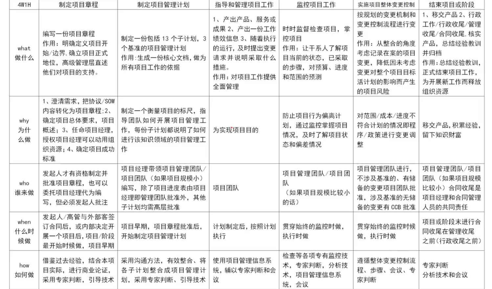

# 【第 4 章】【项目整体管理】【第 16 章】变更管理

## 1 【第 4 章】【项目整体管理】【第 16 章】变更管理

### 1.1 目录

- 项目管理过程/定义
- 项目章程
- 环境组织因素/组织过程资产
- 工作说明书/方法论
- 项目管理计划
- 项目监控
- 项目收尾
- 绩效报告
- 变更
- 综合/对 PM 的要求
- 项目目标
- 净现值/投资回收期

### 1.2 学习方法

- What-每个子过程的定义
- Why-每个子过程的作用
- How-每个子过程的 ITTO
  - ITO（Input Tool&Technology Output）

### 1.3 核心

- 狗子整范进，成人风采
- 沟通、质量、整体、范围、进度、成本、人力资源、干系人管理、风采、采购

### 1.4 整体管理

- 制定项目章程
- 制定项目管理计划
- 指导和管理项目工作
- 监控项目工作
- 实施整体项目控制
- 结束项目或阶段

### 1.5 项目整体过程

1. **制定项目章程：编写一份正式文件的过程，这份文件就是项目章程。通过发布项目章程，正式地批准项目并授权项目经理在项目活动中使用组织资源。**
2. **制定项目管理计划：定义、准备和协调所有子计划，并把他们整合成一份综合项目管理计划的过程。**
3. **指导与管理项目工作：为实现项目目标而领导和执行项目管理计划中所确定的工作，并实施已批准变更的过程。**
4. **监控项目工作：跟踪、审查和报告项目进展，以实现项目管理计划中确定的绩效目标的过程。**
5. **实施整体变更控制：审查所有变更请求，批准变更，管理可交付成果、组织过程资产、项目文件和项目管理计划的变更，并对变更处理结果进行沟通的过程。**
6. **结束项目或阶段：完成所有项目管理过程组的所有活动，以正式结束项目或阶段的过程。**

## 2 【第 4 章】【项目整体管理】【第 16 章】变更管理

### 2.1 整体管理 4W1H

### 2.2 项目章程的内容

- 目的-目标-要求-概括
- 风险-进度-预算-审批
- 项目经理和发起人职权

1. 项目目的或批准项目的**原因**
2. 可测量的项目**目标**和相关的成功标准
3. 项目的总体**要求**
4. 概括性的项目描述
5. 项目的主要**风险**
6. 总体里程碑**进度计划**
7. 总体**预算**
8. 项目**审批**要求
9. 委派的项目经理及其职责和职权
10. 发起人或其他**批准**项目章程的人员的姓名和职权

### 2.3 工作说明书内容

- 也参战
- **业**务需求、**产**品范围说明书、**战**略计划

### 2.4 制定项目管理计划

1. 项目管理计划一般包括项目范围管理计划、进度管理计划、成本管理计划、质量管理计划、过程改进计划、人员配置管理计划、沟通管理计划、风险管理计划、采购管理计划等分计划。项目管理计划详略均可，可由一个或多个部分计划，以及其他事项组成。每一个分计划和其他组成部分的详细程度都要满足具体项目的需要。其他组成部分可以包括这些内容：里程碑清单、资源日历、进度基准、成本基准、风险登记册等。
2. 助记：9 大知识领域各有一个，再加需要和过程改进计划

### 2.5 项目管理计划的内容

1. 项目管理团队选择的各个项目管理过程。
2. 每一个选定过程的实施水平。
3. 对实施这些过程时使用的工具与技术所做的说明。
4. 在管理具体项目中使用选定过程的方式和方法，包括过程之间的依赖关系和相互作用，以及重要的依据和成果。
5. 为了实现项目目标所执行的工作的方式、方法。
6. 监控变更的方式、方法。
7. 实施配置管理的方式、方法。
8. 使用实施效果测量基准并使之保持完整的方式、方法。
9. 项目关系人之间的沟通需要与技术。
10. 选定的项目生命期和多阶段项目的项目阶段。
11. 高层管理人员为了加快解决未解决的问题和处理未做出的决策，对内容、范围和时间安排的关键审查。

- 助记：
  - 选择过程及实施水平；
  - 使用的 TT 及选定方法；
  - 实现目标的方法；
  - 变更和配置方法；
  - 测量基础及沟通需要；
  - 选定的生命期及阶段；
  - 未决问题；

## 3 【第 4 章】【项目整体管理】【第 16 章】变更管理

### 3.1 制定计划通常存在的问题

1. 项目管理计划不应由一人制定，应有项目组参与。
2. 项目计划缺少相关分计划，如质量计划、沟通计划等。
3. 制定进度计划的方法不合理，没有预留一定的缓冲时间。
4. 项目计划缺少评审和审批环节。
5. 没有处理好外部因素（天气）和内部因素（团队）带来的风险，缺乏有效的应对措施
6. 项目发生变更时没有及时更新项目计划。
7. 应识别设备到场所影响的活动，对于不受影响的活动不应推迟进行。

### 3.2 变更管理

- 项目经理的作用
  - 是响应变更提出者的需求，评估变更对项目的影响及应对方案，将需求由技术要求转化为资源需求，供授权人决策；并据评审结果实施即调整基准。确保项目基准反映项目实施情况。
- 变更的工作程序
  1. 提出与接受变更申请
  2. 对变更的初审
  3. 变更方案论证
  4. 项目管理委员会审查
  5. 发出变更通知并组织实施
  6. 变更实施的监控
  7. 判断发生变更后项目是否已纳入正常轨道

## 4 【第 5 章】【项目范围管理】

### 4.1 项目管理 ITO 口决

- 章程计划找业组，专家会议两计划
  - 项目管理计划、项目章程、事业环境因素、组织过程资产
  - 专家判断、会议
  - 范围管理计划、需求管理计划
- 范管求管程人管
  - 范围管理计划、需求管理计划、项目章程、干系人管理计划、干系人登记册
- 焦查原访问群导
  - 焦（焦点小组）查（问卷调查）原（原型法）访（访谈）问群（群体创新技术、群体决策技术）导（引导式研讨会）
- 标杆图文出文矩
  - 标杆图（系统交互图）文（文件分析）出文（需求文件）矩（需求跟踪矩阵）
- 范文程组新文书
  - 范（定义范围）文（需求文件）程（项目章程）组（组织过程资产）新（项目文件更新）文书（项目范围说明书）
- 分家方案研讨会
  - 分（产品分析）家（专家判断）方案（备选方案生成）研讨会（引导式研讨会）

### 4.2 WBS 分解注意的 8 个方面

1. WBS 必须是面向可交付成果的。
2. WBS 必须符合项目的范围
3. WBS 的底层应该支持计划和控制
4. WBS 的元素必须有人负责，而且只由一个人负责，尽管实际上可能需要多个人参与
5. WBS 的指导，WBS 应该控制在 4-6 层
6. WBS 应包括项目管理工作（因为项目管理是具体工作的一部分），也要包括分包出去的工作。
7. WBS 的编制需要所有（主要）项目干系人的参与，
8. WBS 并非一成不变的。在完成 WBS 之后的工作中，仍然有可能需要对 WBS 进行修改。

### 4.3 PDCA

- PDCA 循环的含义是将质量管理分为四个阶段，即 Plan（计划）、Do（执行）、Check（检查）和 Act（处理）

## 5 【第 6 章】【项目进度管理】

### 5.1 考点

1. 活动排序
2. 活动资源估算
3. 活动局时估算/PERT/完工概率
4. 制定计划的工具和技术
5. 进度控制
6. 单/双代号网络图/关键路径
7. 资源平衡

### 5.2 ITO 口决

1. 规划进度管理
   - 章程计划找业主
   - 分家会上进管子
2. 定义活动
   - 业组进管朝基范
   - 分家滚清属里
3. 排列活动顺序
   - 范进业组清属里
   - 前后紧赖网新文
4. 估算活动资源
   - 业组进管估成本，清属资历有风险
   - 自选软件算专家
   - 分解需求新文件
5. 估算活动持续时间
   - 业组资需分日进，清属范书有风险
   - 三类专家数策备
   - 时间估算新文件
6. 制定进度计划
   - 业组资需分日进，清属范书有风险，人员进
   - 压缩网路前后链，优化建模靠工法
   - 进划基数日，新文划
7. 控制进度
   - 两数两划组日历
   - 优化建模需审查，前后压缩编软件
   - 进度预测 5 大件

### 5.3 进度控制关注如下内容

1. 判断项目进度的当前状况
2. 对引起进度变更的因素施加影响，以保证这种变化朝着有利的方向发展。
3. 判断项目进度是否已经发生变更。
4. 当变更实际发生时严格按照变更控制流程对其进行管理。

### 5.4 缩短活动工期的方法

1. 赶工，投入更多的资源或增加工作时间，以缩短关键活动的工期。
2. 快速跟进，并行施工，以缩短关键路径的长度。
3. 使用高素质的资源或经验更丰富的人员。
4. 减少活动范围或降低活动要求。
5. 改进方法或技术，以提高生产效率。
6. 加强质量管理，及时发现问题，减少返工，从而缩短工期。
